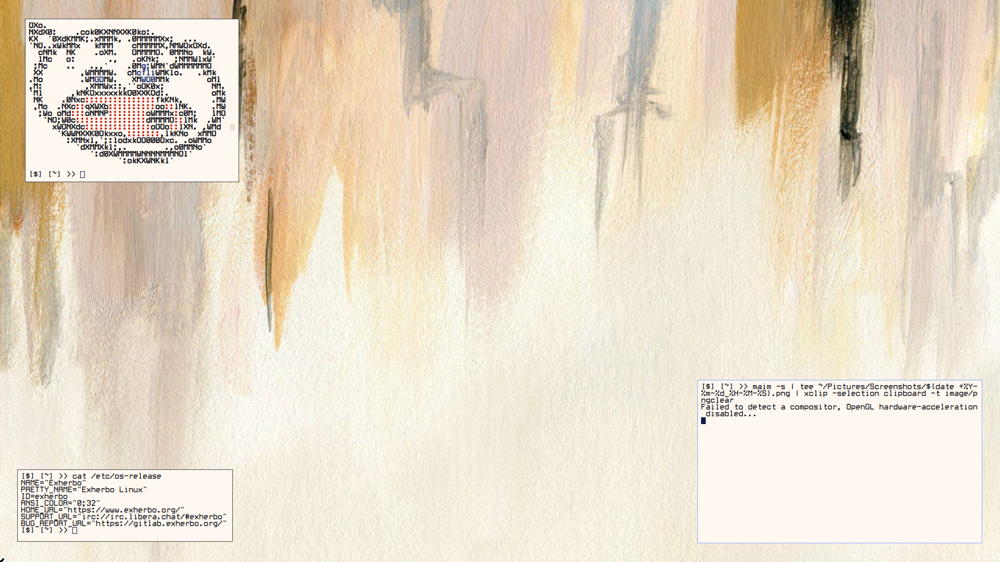

# Void Window Manager

A minimal, extremely fast tiling window manager for X11.

Void WM has **no graphical UI of its own** — no bar, no panel, no
workspace indicator, no decorations, no popups, no on-screen anything.
The only things ever drawn on screen are your applications and the
normal X11 mouse cursor. Configuration is entirely compile-time, in
the spirit of dwm: there is no config file, no config directory, and
no runtime parser. You edit `config.h` and recompile.

## Philosophy

```
X server → Void Window Manager → applications
```

Void WM contributes almost no visual presence and consumes as few
resources as reasonably possible:

- Zero CPU usage at idle (fully event-driven, blocks on `XNextEvent`)
- No background threads, no polling, no timers
- Single dependency: `libX11`
- One small source file, no bar/font/drawing stack

## Features

- 10 workspaces (compile-time configurable count)
- Two layouts: master-stack tiling and monocle (fullscreen-stacked)
- Master area count and size fully adjustable via keybindings
- Floating and fullscreen window support
- Mouse-driven move/resize for floating windows, click-to-focus,
  focus-follows-mouse
- ICCCM (`WM_DELETE_WINDOW`, `WM_TAKE_FOCUS`, `WM_HINTS` urgency,
  transient window detection) and EWMH (`_NET_WM_STATE_FULLSCREEN`,
  `_NET_ACTIVE_WINDOW`, `_NET_CLIENT_LIST`, `_NET_WM_WINDOW_TYPE`,
  per-workspace `_NET_WM_DESKTOP`, etc.) support
- Adopts windows that already exist when the WM starts

## Build

Requires a C compiler, `make`, and the Xlib development headers
(`libx11-dev` / `libX11-devel` depending on your distro).

```sh
make
sudo make install     # installs to /usr/local/bin/void
```

Other targets:

```sh
make clean            # remove the built binary
sudo make uninstall   # remove the installed binary
```

## Running

Add to `~/.xinitrc`:

```sh
exec void
```

then:

```sh
startx
```

Or launch it directly with a client argument:

```sh
startx /usr/local/bin/void
```

### Testing without disturbing your current session

Run it nested inside your existing desktop with Xephyr:

```sh
Xephyr -screen 1280x800 :1 &
DISPLAY=:1 void &
DISPLAY=:1 st &
```

Or start a second, independent X session on another VT
(`Ctrl+Alt+F2`, log in, then `startx /usr/local/bin/void`), leaving
your primary session on the first VT completely untouched.

## Default keybindings

`MODKEY` is `Mod4Mask` (the **Super/Windows** key) by default.

| Keybinding                | Action                                              |
|----------------------------|------------------------------------------------------|
| `Super + Return`           | Launch terminal (`st`)                               |
| `Super + D`                | Launch application menu (rofi)                       |
| `Super + Q`                | Close focused window (polite, falls back to force-kill) |
| `Super + Shift + Delete`   | Quit Void WM                                          |
| `Super + J`                | Focus next window                                     |
| `Super + K`                | Focus previous window                                 |
| `Super + H`                | Shrink master area                                    |
| `Super + L`                | Grow master area                                      |
| `Super + I`                | Increase number of master-area windows                |
| `Super + U`                | Decrease number of master-area windows                |
| `Super + Space`            | Cycle layout (tile ↔ monocle)                         |
| `Super + T`                | Toggle floating on focused window                     |
| `Super + F`                | Toggle fullscreen on focused window                   |
| `Super + Shift + Return`   | Zoom focused window into the master slot              |
| `Super + [1–9, 0]`         | Switch to workspace 1–10                              |
| `Super + Shift + [1–9, 0]` | Move focused window to workspace 1–10                 |
| `Super + drag` (Button1)   | Move a window with the mouse (auto-floats it)          |
| `Super + drag` (Button3)   | Resize a window with the mouse (auto-floats it)        |
| Left click on a window     | Focus it                                              |

Note: this table reflects the keybindings actually shipped in this
repo's `config.h`, which differ slightly from vanilla dwm defaults —
close is `Super+Q` here (not `Super+Shift+C`), quit is
`Super+Shift+Delete` (not `Super+Shift+Q`), and master-count is
adjusted with `Super+I` / `Super+U`.

`Super+D` launches rofi via:

```c
#define MENUCMD { "rofi", "-show", "drun", NULL }
```

`spawn()` uses `execvp`, which takes each argument as a separate
array element — it does **not** parse a shell command string. If you
change this, keep every flag as its own quoted element and always
terminate the array with `NULL`.

## Customizing

Everything user-facing lives in `config.h`:

- `WORKSPACES` — number of workspaces. Add/remove `TAGKEYS(...)`
  lines in `keys[]` to match.
- `MODKEY` — the modifier used for all bindings.
- `BORDERWIDTH`, `GAPPX` — border thickness and gap size in pixels.
- `COLOR_BORDER_NORM` / `COLOR_BORDER_SEL` / `COLOR_BORDER_URGENT` —
  border colors for unfocused, focused, and urgent windows.
- `NMASTER_DEFAULT`, `MFACT_DEFAULT`, `MFACT_MIN/MAX/STEP` — tiling
  layout defaults and limits.
- `TERMCMD`, `MENUCMD` — commands launched by their respective keys.
- `keys[]` — the full keybinding table: `{ modifiers, XK_keysym,
  function, arg }`.

After any change:

```sh
make clean install
```

There is no way to change any of this at runtime — that's
intentional.

## Layouts

- **tile** — a master area (left) and a stack area (right).
  `Super+H`/`Super+L` resize the split; `Super+I`/`Super+U` change
  how many windows sit in the master area.
- **monocle** — every tiled window is resized to fill the entire
  screen and stacked on top of each other; only the focused one is
  visible. Useful for single-task focus (`Super+Space` to switch
  into it, `Super+J`/`Super+K` to cycle which window is on top).

## Obligatory Screenshot



## Limitations

- Single monitor only — no Xinerama/RandR multi-head layout
- ICCCM `WM_NORMAL_HINTS` (min/max/aspect size hints) are not enforced
